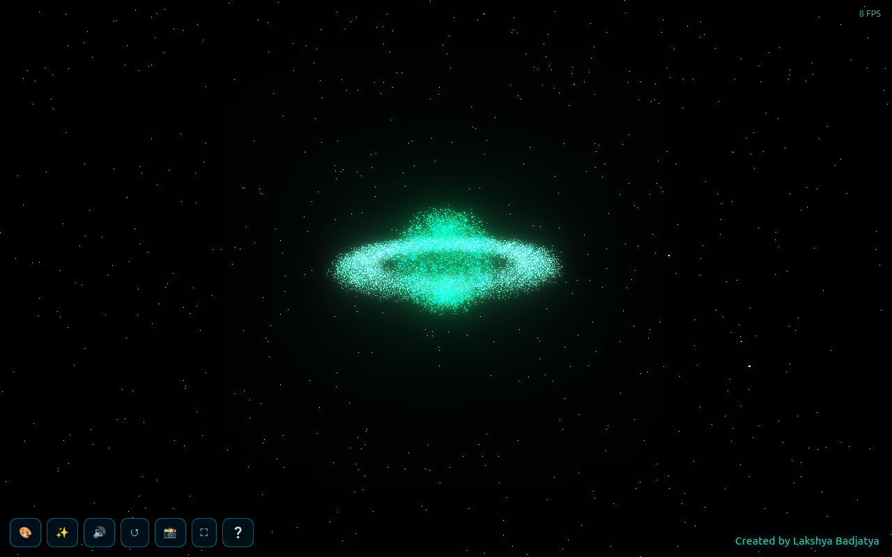
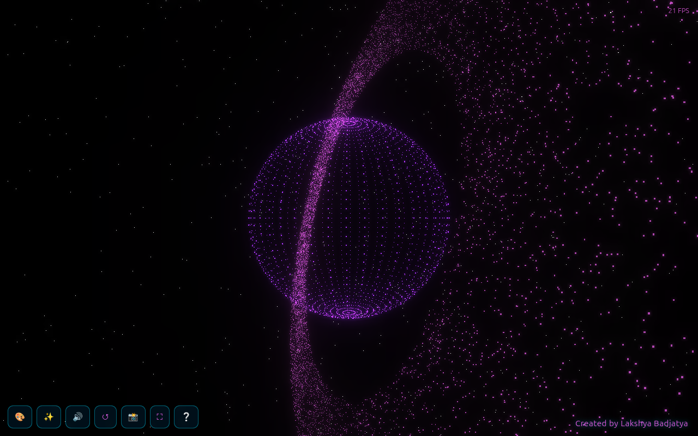
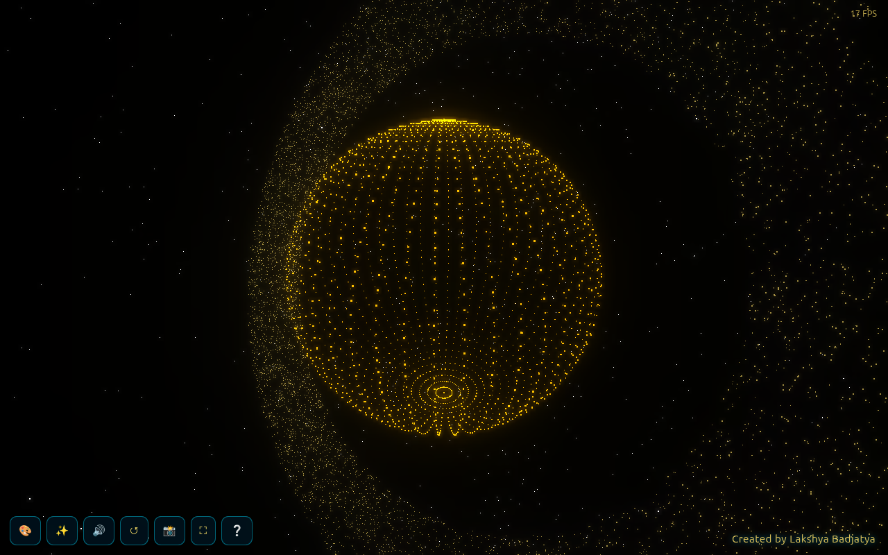

# 🪐 Interactive 3D Saturn — Control the Cosmos with Your Hands

> A 3D particle Saturn you play with using **just your webcam and your hands** — no mouse, no keyboard, no controller. Open your palm and the planet bursts into stardust that follows you. Make a fist and grab it. Pinch to zoom. Throw up a peace sign to repaint the whole universe.

Built with **Three.js** for the 3D graphics and **Google MediaPipe Hands** for real-time hand tracking — running entirely in the browser, with nothing to install.

**🔴 Live demo:** https://lakshyabadjatya.github.io/interactive-3d-saturn/



---

## ✨ What it does

Point your webcam at your hand and the planet reacts to how you move and what gesture you make. Every particle is a live 3D point — about ten thousand of them forming the planet and its rings — and they respond to your hand in real time.

It also works **without a webcam**: use the on-screen buttons, drag with your mouse, and scroll to zoom.

---

## 🎬 Screenshots

| Particles scattering | Tilted globe (Solar Gold theme) |
| --- | --- |
|  |  |

---

## 🕹️ How to play

Allow camera access, then try these:

| Gesture | What happens |
| --- | --- |
| ✋ **Open hand** | The planet explodes into dust and the particles **chase your hand** |
| ✊ **Fist** | **Grab** the planet and rotate it by moving your hand |
| 🤏 **Pinch** (thumb + index) | **Zoom** in and out |
| ✌️ **Peace sign** | **Change the colour theme** |
| 👍 **Thumbs up** | **Reset** the view |
| 🙌 **Two hands** | Pull them **apart / together to resize** the planet |

### 🎨 Colour themes
Cosmic Blue · Nebula Purple · Solar Gold · Aurora Green · Crimson Star

---

## ⌨️ Controls (no webcam needed)

A toolbar sits in the bottom-left, and every action also has a keyboard shortcut:

| Key | Button | Action |
| --- | --- | --- |
| `C` | 🎨 | Change colour theme |
| `T` | ✨ | Toggle particle **trails** |
| `M` | 🔊 | Mute / unmute sound effects |
| `R` | ↺ | Reset the view |
| `P` | 📸 | Save a **screenshot** (PNG) |
| `F` | ⛶ | Fullscreen |
| `H` | ❔ | Show / hide the help panel |

You can also **drag with the mouse** to rotate, **scroll** to zoom, and **double-click** to scatter the particles.

---

## 🚀 Run it locally

Because it uses your webcam, browsers require the page to be served over `http://localhost` (or HTTPS) — opening the file directly with `file://` may block the camera.

**Option 1 — Python (already on most machines):**
```bash
python3 -m http.server 8000
```
Then open <http://localhost:8000/index.html> in your browser.

**Option 2 — Node (if you have it):**
```bash
npx serve .
```

Then allow camera access when prompted. That's it — no build step, no dependencies to download.

---

## 🧠 How it works (the short version)

- A **sphere** and a flat **ring** are both turned into clouds of individual points (`THREE.Points`).
- Every frame, **MediaPipe Hands** finds 21 landmarks on your hand from the webcam feed.
- Those landmarks are read to detect gestures (fist, pinch, peace, thumbs-up) and to find your palm position.
- When your hand opens, each particle smoothly **interpolates toward your palm**; when you close your fist, your hand movement is mapped to the planet's rotation.
- A **bloom (glow) post-processing pass** gives everything that neon, luminous look.
- Performance is kept smooth by only recalculating particle positions while something is actually moving, using the lightweight hand-tracking model, and capping the render resolution.

---

## 🛠️ Tech stack

- [Three.js](https://threejs.org/) (r128) — WebGL 3D rendering + UnrealBloom post-processing
- [MediaPipe Hands](https://developers.google.com/mediapipe) — real-time hand landmark detection
- Vanilla **HTML / CSS / JavaScript** — a single self-contained file, no framework, no build tools
- **Web Audio API** — sound effects generated in code (no audio files)

## 🌐 Browser support

Works best in **Chrome / Edge** on a desktop with a webcam. Any modern browser with WebGL and camera support will run it.

---

## 👤 Author

**Lakshya Badjatya**
A creative coding / portfolio project exploring gesture-based interaction in the browser.

## 📄 License

Released under the [MIT License](LICENSE) — free to use, learn from, and build on.
